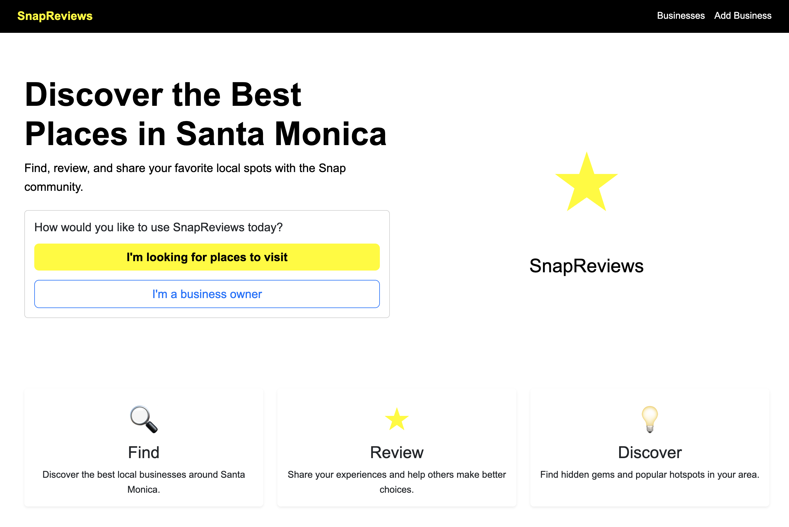
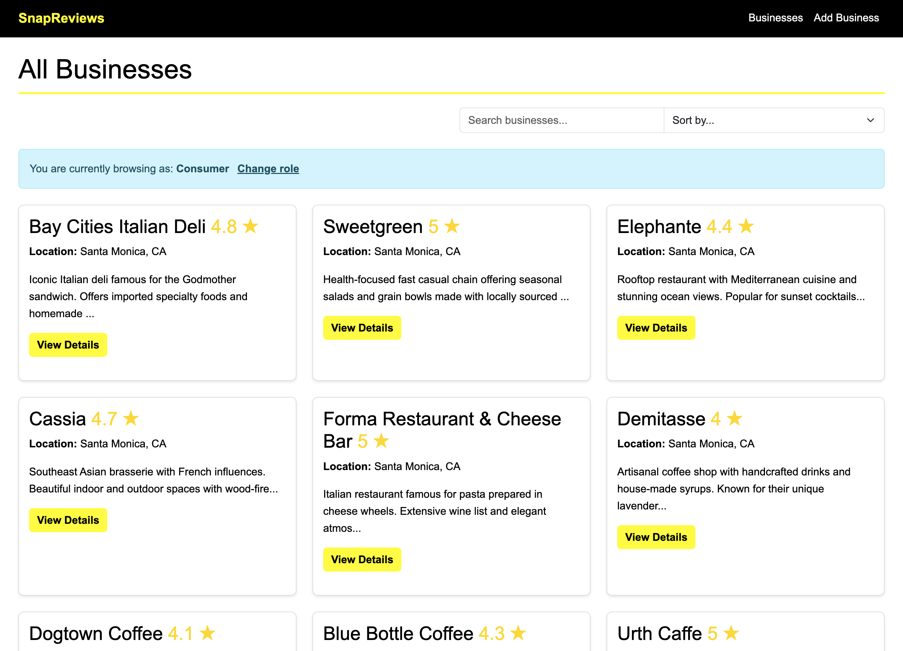
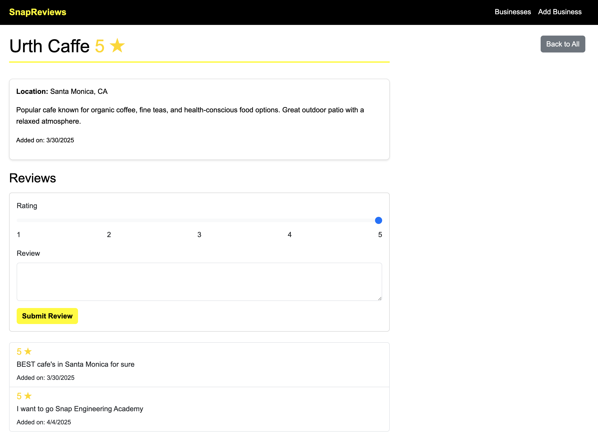

# SnapReviews - A Yelp Clone

This project was originally developed during my time at Atom Tech Solutions and has been redesigned specifically for my Snap Engineering Academy application.

**SnapReviews** is designed for users to discover, review, and share local businesses in Santa Monica.

## Screenshots

### Homepage

### Business Listings

### Business Details

## Live Demo

Check out the live application: [https://snapreviews-2nd.onrender.com](https://snapreviews-2nd.onrender.com)

*Since this application is hosted on Render's free tier, it may take up to 30 seconds if the app has been inactive. Thanks for your patience.*

## Features

- **Role-based access**: Different interfaces for business owners and consumers
- **Business listings**: View, search, and sort local businesses in Santa Monica
- **Review system**: Rate and review businesses (consumer role only)
- **Business management**: Add, edit, and delete businesses (owner role only)
- **Responsive design**: Mobile-friendly interface
- **Real-time search and sort**: Dynamic filtering without page reload

## Technologies Used

- **Backend**: Node.js, Express.js
- **Database**: MongoDB, Mongoose ODM
- **Frontend**: EJS templates, Bootstrap 5
- **Styling**: Custom CSS with Snap Inc. branding (yellow, black, white)
- **Deployment**: Render and MongoDB Atlas

## Project Structure

The project follows a classic MVC pattern with clear separation of concerns:

SnapReviews/
- config/ - Configuration files
- models/ - Database models
- public/ - Static assets
  - css/ - Stylesheets
  - js/ - Client-side JavaScript
- routes/ - Express routes
- views/ - EJS templates
  - businesses/ - Business-related views
  - partials/ - Reusable view components
- app.js - Application entry point
- .env - Environment variables (not tracked)
- package.json - Project dependencies
- README.md - Project documentation  

## Local Development Setup

1. Clone the repository:
git clone https://github.com/jurinho17-sv/YelpClone.git
cd YelpClone

2. Install dependencies:
npm install

3. Create a `.env` file in the root directory with the following variables:
PORT=3000
MONGODB_URI=your_mongodb_connection_string

4. Start the application:
node app.js

5. Open your browser and navigate to `http://localhost:3000`

## User Roles

### Consumer
- Browse businesses
- Search and sort businesses
- Read reviews
- Leave reviews for businesses

### Business Owner
- All consumer permissions
- Create new business listings
- Edit existing business information
- Delete businesses
- Delete reviews

## Credits

This project was developed as part of my preparation for the Snap Engineering Academy application, combining my web development skills with Snap's branding and design aesthetic.

Thanks for your attention to my project.